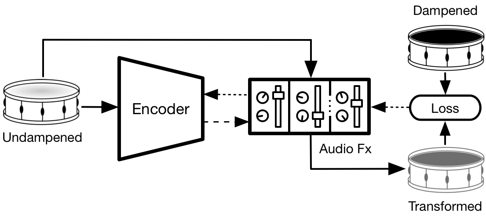

# Deep Audio FX for Snare Drum Recording Transformations

The positioning and recording of a standard acoustic drum kit—comprising of kick, snare and tom drums, and an assortment of hi-hats and other cymbals, is a technical and time-consuming endeavour.During a typical recording session, an engineer must modify a large number of recording parameters to achieve a desired result. Key considerations include the selection of drums and drumheads, drum tuning and dampening, room and in-room placement, and the selection, arrangement and positioning of microphones. Time permitting an engineer may test different parameter options to identify an appropriate configuration for a song before committing to the final recording; however, with many variables this can easily become a lengthy process. As such, the ability to perceptually-modify these recording parameters in a post-recording process would be of great benefit to engineers limited by time or equipment, especially during sessions where compromises may need to be made. In this work, a system is proposed for post-recording modification of the dampening and microphone positioning parameters commonly associated with snare drum capture.

The system is based on a modified version of [DeepAFx: Deep Audio Effects](https://github.com/adobe-research/DeepAFx)